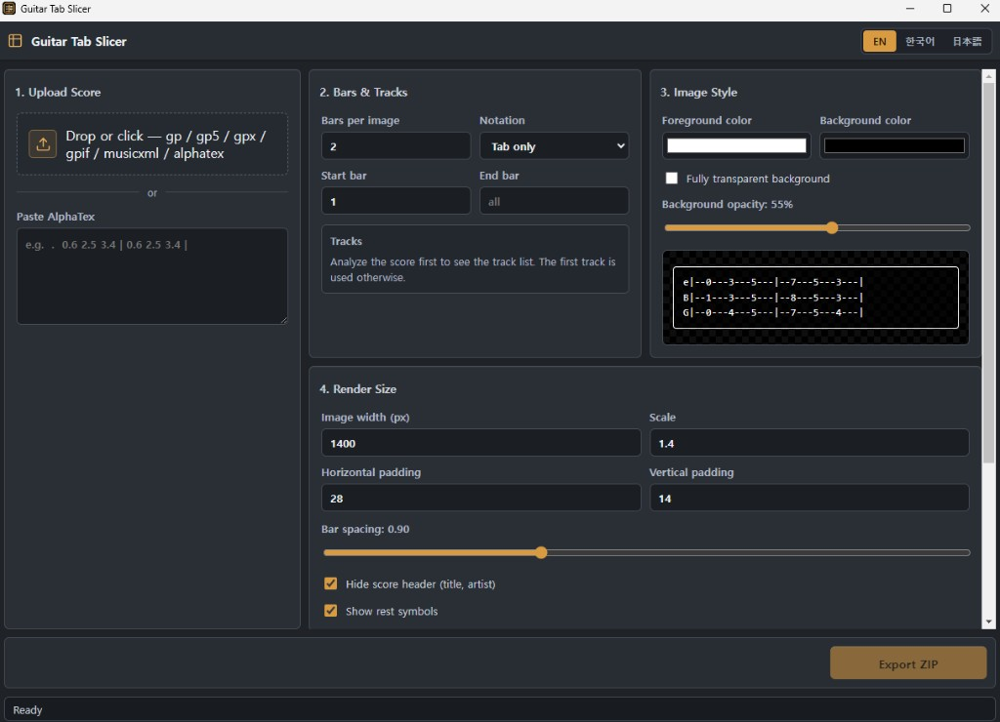
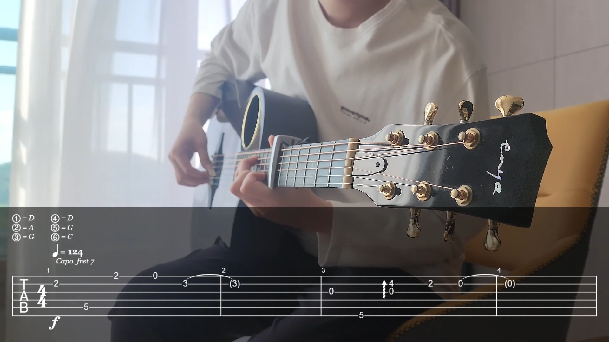

# Guitar Tab Slicer

[English](README.md) | [한국어](README.ko.md)

Slice guitar scores into video-ready PNG overlays and download them as a ZIP. Upload Guitar Pro, MusicXML, or AlphaTex, pick a bar range, and render N bars per image.



## Features

- Upload `.gp`, `.gp3`, `.gp4`, `.gp5`, `.gpx`, `.gpif`, `.musicxml`, `.xml`, `.alphatex`, `.txt`
- Paste AlphaTex directly
- Bars per image, start/end bar, and track selection
- Tab only / Score + Tab / Score only / Tab mixed
- Foreground/background colors, background opacity, fully transparent PNG
- Image width, scale, padding, and bar spacing
- Hide score header (title, artist)
- EN / 한국어 / 日本語
- ZIP download with `manifest.json`

## How to use

1. **Upload Score** — drop a score file or paste AlphaTex.
2. **Bars & Tracks** — set bars per image, notation, bar range, and tracks.
3. **Image Style** — pick colors and opacity. Check the preview.
4. **Render Size** — adjust width, scale, padding, and bar spacing.
5. **Export ZIP** — download a ZIP of PNG slices.

## Usage example

Exported PNGs are meant to sit over guitar tutorial videos as a tab overlay.



## Run locally

Node.js 20 or later is recommended.

```bash
npm install
npm run dev
```

Open `http://localhost:5173`. In development, Vite proxies `/api` requests to the Express server.

## Production

```bash
npm install
npm run build
npm start
```

The default port is `3001`. Override it with an environment variable if needed:

```bash
PORT=8080 npm start
```

## Docker

```bash
docker build -t guitar-tab-slicer .
docker run --rm -p 3001:3001 guitar-tab-slicer
```

Then open `http://localhost:3001`.

## Layout

```text
server/index.mjs   Express API, alphaTab/alphaSkia rendering, ZIP export
src/App.jsx        Web UI
src/styles.css     Styles
vite.config.js     Dev-server proxy and build config
```

## API

### `POST /api/score`

Send a score file in the multipart field `score`. Returns score metadata.

### `POST /api/render`

Send a score file in the multipart field `score` plus render options. Returns a ZIP.

Example options:

```text
barsPerImage=2
startBar=1
endBar=16
tracks=[0]
staveProfile=tab
foregroundColor=#ffffff
backgroundColor=#000000
backgroundOpacity=0.55
transparent=false
width=1400
scale=1.4
paddingX=28
paddingY=14
stretchForce=0.9
hideScoreInfo=true
```

## Notes

- Rendering runs on the server. For a public deploy, avoid storing uploads, and add request size limits, rate limiting, and a job queue.
- Large GP files or multi-track scores can take a while to render.
- AlphaSkia uses OS-specific native packages. This project lists Linux/macOS/Windows packages as optional dependencies.
- If the PNG looks too small or soft in a video editor, raise **Image width** and **Scale**.
